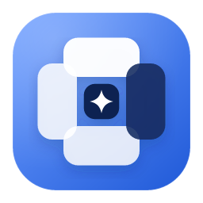

<div align="center">
  
  <h1>Nib</h1>
  <p><strong>macOS 个人工作台</strong></p>
  <p>把任务流转、常用文档与个性化工作环境，收进一个轻量、本地优先的桌面应用。</p>
</div>

---

## 主要能力

### Loop · 任务工作流

Loop 是一个可自由配置的个人看板：

- 自由增删、重命名和排序看板列，组织自己的工作流；
- 拖拽卡片进行列内排序或跨列流转；
- 为卡片设置状态、标签、说明和参考链接；
- 支持列表内快速新建、批量移动、归档和移入回收站；
- 可调整列宽、卡片密度，以及状态、标签和链接的显示方式。

### Atlas · 文档导航

Atlas 用来集中管理常用网站与在线文档：

- 按分类整理链接，点击卡片即可使用系统默认浏览器打开；
- 支持分类和文档的新增、编辑、删除及排序；
- 编辑模式下可拖拽文档，在同分类内调整位置或移动到其他分类；
- 可调整卡片宽度，并导入或导出 Atlas 数据。

### 工作台与个性化

- 在侧边栏中快速切换应用，也可收起侧边栏获得更大的内容区域；
- 支持页面全屏，仅隐藏侧边栏，不打断 macOS 的窗口状态；
- 内置深色与浅色外观预设，也可逐项调整界面配色；
- 界面字体和内容字体可分别设置，并支持整体缩放；
- 常用操作均可配置快捷键，冲突时会即时提示；
- 支持配置的复制、导入与导出，便于备份和迁移。

## 默认快捷键

| 操作 | 快捷键 |
| --- | --- |
| 打开设置 | `⌘,` |
| 切换页面全屏 | `⌘ Enter` |
| 切换到 Loop | `⌘1` |
| 切换到 Atlas | `⌘2` |

以上快捷键可以在「设置 → 快捷键」中修改。

## 数据与隐私

Nib 不要求注册或登录，也不依赖云端同步。任务、文档导航和应用配置均在本机保存和处理。

Loop、Atlas 以及个性化配置分别管理，并支持以 JSON 格式导出，方便自行备份、恢复或迁移。

## 获取与安装

请前往 [GitHub Releases](https://github.com/kidyme/nib/releases) 下载适用于 macOS 的最新版本。

安装时打开 DMG，将 Nib 拖入「应用程序」即可。若 macOS 首次启动时提示无法验证开发者，请在「系统设置 → 隐私与安全性」中允许打开。

## 本地运行

```bash
pnpm install
pnpm tauri dev
```

需要本机已安装 Node.js、pnpm 与 Rust 工具链。

## 反馈

如果遇到问题或有功能建议，欢迎提交 [Issue](https://github.com/kidyme/nib/issues)。
